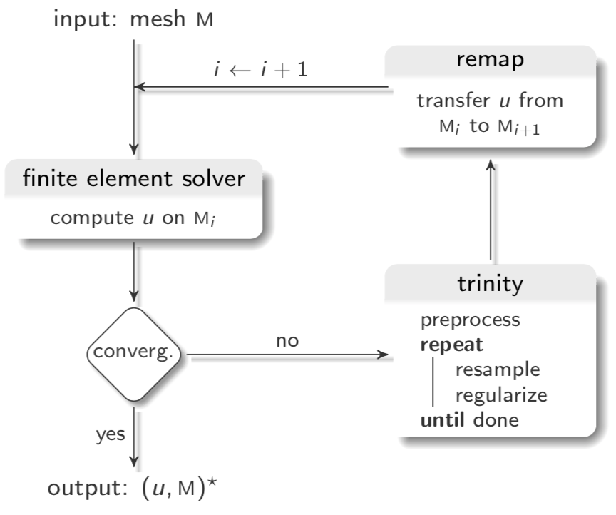
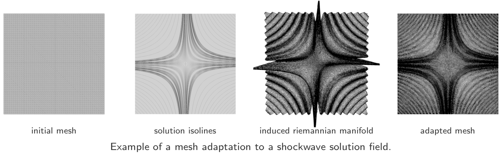
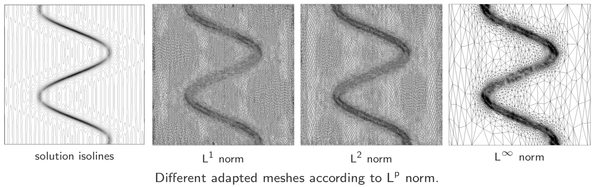
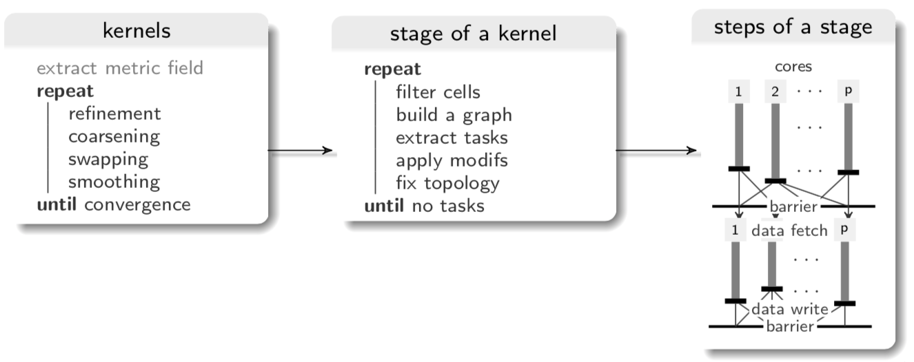
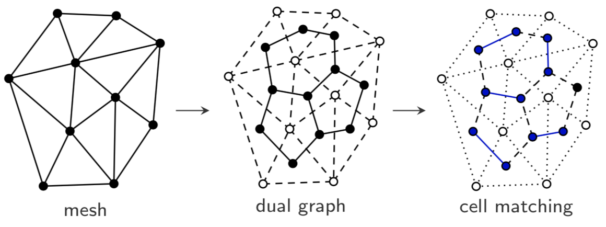
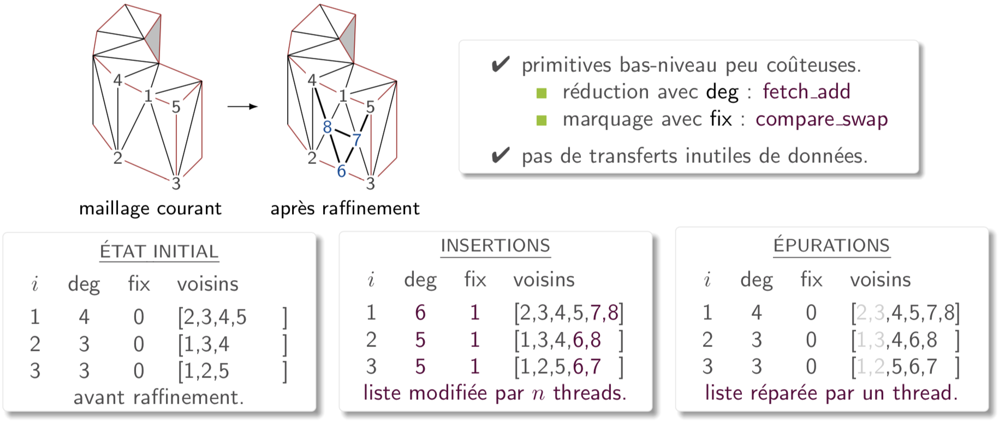
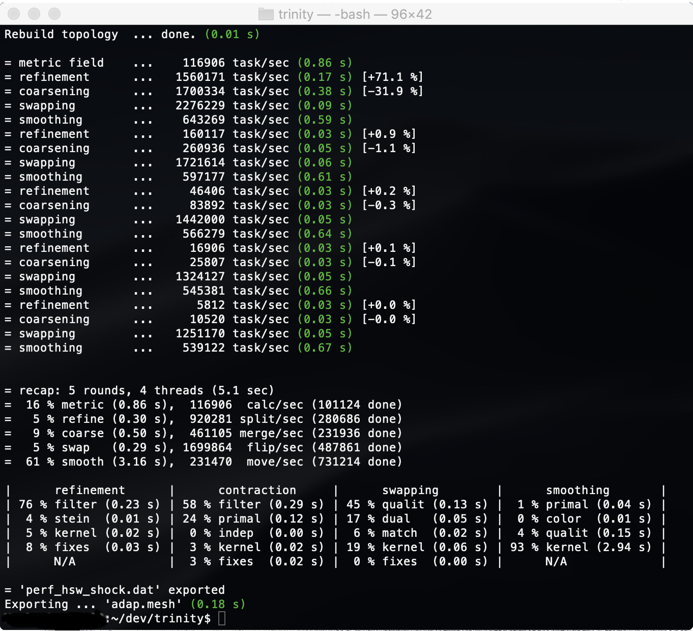

# trinity
[](https://www.gnu.org/licenses/gpl-3.0)
[](http://www.repostatus.org/#suspended)

###### Description
**trinity** is a [C++14](https://isocpp.org/wiki/faq/cpp14-language) library and command-line tool for [anisotropic mesh adaptation](https://www.karlin.mff.cuni.cz/~dolejsi/Vyuka/AMA.pdf).  
It is targetted to [non-uniform memory access](https://en.wikipedia.org/wiki/Non-uniform_memory_access) multicore and [manycore](https://en.wikipedia.org/wiki/Manycore_processor) processors.  
It is intended to be involved within a [numerical simulation](https://en.wikipedia.org/wiki/Computational_fluid_dynamics) loop.  



It aims to reduce and equidistribute the interpolation error of a computed physical field **_u_** on a triangulated **planar**  
domain **M** by adapting its discretization with respect to a target number of points **_n_**.  
Basically, it takes (**_u_**, **M**, **_n_**) and outputs a mesh adapted to the variation of the gradient of **_u_** on **M** using **_n_** points.  
It uses [metric tensors](https://en.wikipedia.org/wiki/Metric_tensor) to encode the desired point distribution with respect to the estimated error.  
It was primarly designed for **performance** and is intended for [HPC](https://en.wikipedia.org/wiki/Parallel_computing) applications.




<!--###### Motivations-->

----
### Build and use
###### Build
**trinity** is completely standalone.  
It can be built on Linux or macOS using [CMake](https://cmake.org).  
It only requires a [C++14](https://isocpp.org/wiki/faq/cpp14-language) compiler endowed with [OpenMP](https://www.openmp.org).  
It can build [medit](https://www.ljll.math.upmc.fr/frey/publications/RT-0253.pdf) to render meshes but it is optional though.  
It supports [hwloc](https://www.open-mpi.org/projects/hwloc/) to retrieve and print more information on the host machine.  

``` bash
git clone https://github.com/hobywan/trinity.git .      # or through SSH
mkdir build                                             # out-of-source build recommended
cd build                                                #
cmake ..                                                # can toggle -DBuild_Medit=[ON|OFF]
make -j4                                                # use multiple jobs for compilation
make install                                            # optional, can use a prefix
```

###### Use the library
**trinity** is exported as a package.  
To use it in your project, update your CMakeLists.txt with:

``` cmake
find_package(trinity REQUIRED)                          # works for both build/install trees
target_link_libraries(${target} PUBLIC trinity)         # replace 'target' with your library/binary
```
And then include `trinity/core.h` in your application.  
Please take a look at the example folder for basic usage.

###### Use the tool
The list of command arguments is given by the `-h` option.  

``` console
host:~$ bin/trinity -h
Usage: trinity [options]

Options:
  -h, --help            show this help message and exit
  -m CHOICE             select mode [release|benchmark|debug]
  -a CHOICE             cpu architecture [skl|knl|kbl]
  -i STRING             initial mesh file
  -o STRING             result mesh file
  -s STRING             solution field .bb file
  -c INT                number of threads
  -b INT                vertex bucket capacity [64-256]
  -t FLOAT              target resolution factor [0.5-1.0]
  -p INT                metric field L^p norm [0-4]
  -r INT                remeshing rounds [1-5]
  -d INT                max refinement/smoothing depth [1-3]
  -v INT                verbosity level [0-2]
  -P CHOICE             enable papi [cache|cycles|tlb|branch]
```
For now, only `.mesh` files used in [medit](https://www.ljll.math.upmc.fr/frey/publications/RT-0253.pdf) are supported.

----
### Features and algorithms
###### Core features
**trinity** enables to **resample** and **regularize** a planar triangular mesh **M**.  
It aims to reduce and equidistribute the error of a solution field **_u_** on **M** using **_n_** points.  
For that, it uses five kernels:

- [metric recover](sources/metric.h): compute a tensor field which encodes desired point density.
- [refinement](sources/refinement.h): add points on areas where the error of **_u_** is large.
- [coarsening](sources/coarsening.h): remove points on areas where the error of **_u_** is small.
- [swapping](sources/swapping.h): flip edges to locally improve cell quality.
- [smoothing](sources/smoothing.h): relocate points to locally improve cell qualities.

<!--A basic usage would be:

``` c++  
  mesh.load(input, solut);                      // load mesh and solution field in memory
  metric.run();                                 // compute a metric tensor for each point

  for (int i = 0; i < nb_rounds; ++i) {
    refine.run();                               // split long edges in metric space
    coarse.run();                               // collapse short edges in metric space
      swap.run();                               // flip edges of bad cells in metric space
    smooth.run();                               // relocate vertices of bad cells in metric space
  }
  mesh.store(result);                           // save resulting mesh on disk
```
>💡 To enable profiling, you can pass a [`Stats`](sources/header.h) instance pointer as argument of each `run`.  -->

###### Error estimate
**trinity** uses [metric tensors](https://en.wikipedia.org/wiki/Metric_tensor) to link the error of **_u_** with mesh points distribution.   
A tensor encodes the desired edge length incident to a point, which may be [direction-dependent](https://en.wikipedia.org/wiki/Anisotropy).  
**trinity** enables to tune the sensitivity of the error estimate according to the simulation needs.  
For that, it provides a multi-scale estimate in [**L^_p_** norm](https://en.wikipedia.org/wiki/Lp_space): 

- a small **_p_** will distribute points to capture all scales of the error of **_u_**.
- a large **_p_** will distribute points mainly on large variation areas (shocks).

It actually implements the [continuous metric](https://link.springer.com/chapter/10.1007/978-3-540-34958-7_12) defined in:
>📄 Fréderic Alauzet, Adrien Loseille, Alain Dervieux and Pascal Frey (2006).  
"Multi-Dimensional Continuous Metric for Mesh Adaptation".  
In _proceedings of the 15th International Meshing Roundtable_, pp 191-214, Springer Berlin.

To obtain a good mesh, it needs an accurate metric tensor field.  
The latter rely on the computation of the variations of the gradient of **_u_**.  
It is given by its local [hessian matrices](https://en.wikipedia.org/wiki/Hessian_matrix).  
It is computed in **trinity** through a [L^2 projection](https://doi.org/10.1002/nme.2036).  



###### Fine-grained parallelism
**trinity** enables intra-node parallelism by [multithreading](https://en.wikipedia.org/wiki/Multithreading_(computer_architecture)).  
It relies on a [fork-join](https://en.wikipedia.org/wiki/Fork–join_model) model through [OpenMP](https://www.openmp.org).  
All kernels are structured into [bulk-synchronous](https://doi.org/10.1016/j.jcss.2010.06.012) stages.  
A stage consists of local computation, a [reduction](https://en.wikipedia.org/wiki/Reduce_(parallel_pattern)) in shared-memory, and a [barrier](https://en.wikipedia.org/wiki/Barrier_(computer_science)).  

<table>
  <tr><td></td></tr>
</table>  

>It does **not** rely on [domain partitioning](http://www.cs.cmu.edu/~quake/sc96/node5.html) unlike coarse-grained parallel remeshers.  
>It does **not** rely on [task parallelism](https://en.wikipedia.org/wiki/Task_parallelism) and runtime capabilities such as [Cilk](http://supertech.csail.mit.edu/papers/PPoPP95.pdf), [TBB](https://software.intel.com/en-us/intel-tbb) or [StarPU](http://starpu.gforge.inria.fr) neither.  

In fact [manycore](https://en.wikipedia.org/wiki/Manycore_processor) machines have plenty of slow cores with small caches.  
To scale up, one needs plenty of very thin and local tasks to keep them busy.  
In **trinity**, remesh kernels are expressed into a [graph](https://en.wikipedia.org/wiki/Graph_(discrete_mathematics)), except for refinement.  
Runnable tasks are then extracted using multithreaded heuristics:

- maximal [stable set](https://en.wikipedia.org/wiki/Maximal_independent_set) for coarsening
- maximal [matching](https://en.wikipedia.org/wiki/Matching_(graph_theory)) for swapping
- maximal [coloring](https://en.wikipedia.org/wiki/Graph_coloring) for smoothing



 **trinity** fixes incidence data only at the end of a round of any kernel.  
It uses an explicit synchronization scheme to fix them.  
It relies on the use of low-level [atomic primitives](https://fr.cppreference.com/w/cpp/atomic).  
It was designed to minimize data movement penalties, especially on [NUMA](https://en.wikipedia.org/wiki/Non-uniform_memory_access) cases. 



For further details, please take a look [at](https://doi.org/10.1007/978-3-319-64203-1_43):

>📄 Hoby Rakotoarivelo, Franck Ledoux, Franck Pommereau and Nicolas Le-Goff (2017).  
"Scalable fine-grained metric-based remeshing algorithm for manycore/NUMA architectures".  
In _Euro-Par 23: Parallel Processing_, pp 594-606, Spain.


----
### Benchmark
###### Profiling  
**trinity** is natively instrumented.  
It prints the runtime stats with three verbosity level.  
Here is an output example with the medium level.



>💡 Stats are exported within the [data](data/) subfolder by default.  
 👉 They can be plotted using [gnuplot](http://www.gnuplot.info) or [matplotlib](https://matplotlib.org) scripts.

**trinity** supports [PAPI](http://icl.utk.edu/papi/) hardware counters if available on the host machine.   
They can be used to compute the arithmetic intensity of each kernel for a [roofline model](https://en.wikipedia.org/wiki/Roofline_model).  
Here is an example of use:

``` c++
#ifdef HAVE_PAPI                                           // avoid compilation errors
using namespace trinity;
int const nb_kernels = 4;
int const nb_threads = omp_get_max_threads();              // thread-core affinity should be set
int const papi_mode  = PAPI_mode_cache;                    // choose to profile cache performance
papi::Cache count[nb_kernels];                             // cache counters per thread

papi::init(nb_threads, papi_mode, count);                  // initialize all counters

for (int i = 0; i < nb_kernels; ++i) { 
  papi::start(count[i]);                                   // start profile
  kernel[i].run();                                         // a kernel you wanna profile
  papi::stop(count[i]);                                    // stop 
}

papi::finalize(count);                                     // report counters values and clean-up
#endif
```
>💡 You can profile either CPU cycles, caches, instructions or [TLB](https://en.wikipedia.org/wiki/Translation_lookaside_buffer) performances. 

###### Deployment on a cluster
Preparing a benchmark campaign can be tedious 😩   
I included some python [scripts](scripts/) to help setting it up on a node.  
They enable to:

- compute a synthetic solution field.
- rebuild sources and set [thread-core affinity](https://en.wikipedia.org/wiki/Processor_affinity).
- set [memory affinity](https://blogs.cisco.com/performance/process-and-memory-affinity-why-do-you-care) through [`numactl`](https://linux.die.net/man/8/numactl), which is useful on a [Intel KNL](https://colfaxresearch.com/knl-numa/) node.
- compact profiling data and generate [gnuplot](http://www.gnuplot.info) script for plots.
- profile [memory bandwith](https://en.wikipedia.org/wiki/Memory_bandwidth) of the host machine using [STREAM](https://www.cs.virginia.edu/stream/).  
- plot sparsity pattern of mesh incidence graph using [matplotlib](https://matplotlib.org).

>⚠️ They are somewhat outdated, so adapt them to your needs.

----
### License and contributions
###### Copyright (c) 2016 Hoby Rakotoarivelo

<a href="https://www.gnu.org/licenses/gpl-3.0"></a> <a href="https://en.wikipedia.org/wiki/Open-source_software"></a>

**trinity** is free and open-source.  
It was intended for research purposes and released under the [GPL](https://www.gnu.org/licenses/gpl-3.0) license.  
It was written during my doctorate, so improvements are welcome 😊   
To get involved, you can:

- report bugs or request features by submitting an [issue](https://github.com/hobywan/trinity/issues).
- submit code contributions using feature branches and [pull requests](https://github.com/hobywan/trinity/pulls).

Enjoy! 😉
