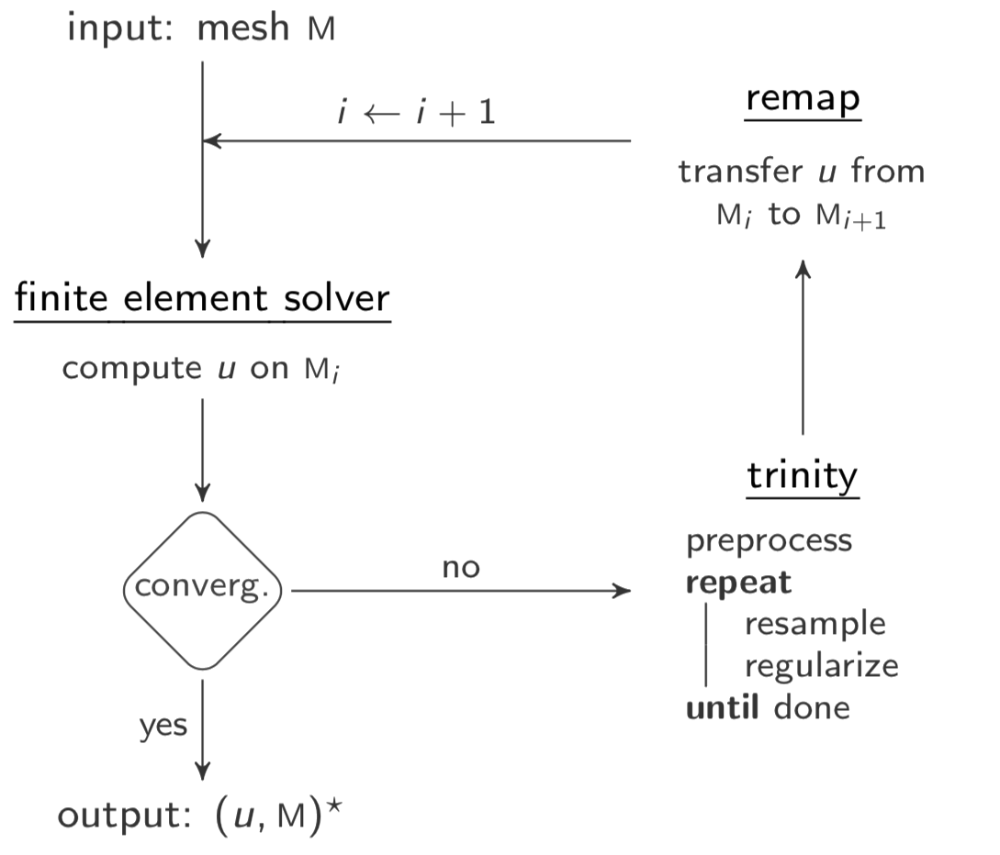

**trinity** is a [C++14](https://isocpp.org/wiki/faq/cpp14-language) library and command-line tool for [anisotropic mesh adaptation](https://www.karlin.mff.cuni.cz/~dolejsi/Vyuka/AMA.pdf).  
It is targetted to [non-uniform memory access](https://en.wikipedia.org/wiki/Non-uniform_memory_access) multicore and [manycore](https://en.wikipedia.org/wiki/Manycore_processor) processors.  
It is intended to be involved within a numerical simulation loop.  



[](https://travis-ci.com/hobywan/trinity)
[](https://www.codacy.com?utm_source=github.com&amp;utm_medium=referral&amp;utm_content=hobywan/trinity&amp;utm_campaign=Badge_Grade)
[](https://www.apache.org/licenses/LICENSE-2.0)

It aims to reduce and equidistribute the interpolation error of a computed physical field **_u_** on a triangulated  
**planar** domain **M** by adapting its discretization with respect to a target number of points **_n_**.  
Basically, it takes (**_u_**, **M**, **_n_**) and outputs a mesh adapted to the variation of the gradient of **_u_** on **M** using **_n_** points.  
It uses [metric tensors](https://en.wikipedia.org/wiki/Metric_tensor) to encode the desired point distribution with respect to the estimated error.  
It was primarly designed for **performance** and is intended for [HPC](https://en.wikipedia.org/wiki/Parallel_computing) applications.


----
### Build and use
###### Build
[](https://travis-ci.com/hobywan/trinity)

**trinity** is completely standalone.  
It can be built on Linux or macOS using [CMake](https://cmake.org).  
It only requires a [C++14](https://isocpp.org/wiki/faq/cpp14-language) compiler endowed with [OpenMP](https://www.openmp.org).  
It can build [medit](https://www.ljll.math.upmc.fr/frey/publications/RT-0253.pdf) to render meshes but it is optional though.  
It supports [hwloc](https://www.open-mpi.org/projects/hwloc/) to retrieve and print more information on the host machine.  

``` bash
mkdir build                                          # out-of-source build recommended
cd build                                             #
cmake ..                                             # see build options below
make -j4                                             # use multiple jobs for compilation
make install                                         # optional, can use a prefix
```
| Option           | Description                                                                                      | Default |   
|------------------|--------------------------------------------------------------------------------------------------|---------|   
| `Build_Medit`    | Build [medit](https://www.ljll.math.upmc.fr/frey/publications/RT-0253.pdf) mesh renderer         | `ON`    |   
| `Build_GTest`    | Build [googletest](https://github.com/google/googletest) for *future* unit tests                 | `OFF`    |   
| `Build_Main`     | Build the command-line tool                                                                      | `ON`    |
| `Build_Examples` | Build provided examples                                                                          | `ON`    |   
| `Use_Deferred`   | Use deferred topology updates scheme in [pragmatic](https://github.com/meshadaptation/pragmatic) | `OFF`   |  

###### Use the library
[](https://www.codacy.com?utm_source=github.com&amp;utm_medium=referral&amp;utm_content=hobywan/trinity&amp;utm_campaign=Badge_Grade)

**trinity** is exported as a package.  
To use it in your project, update your CMakeLists.txt with:

``` cmake
find_package(trinity)                                # works for both build/install trees
target_link_libraries(target PRIVATE trinity)        # replace 'target' with your library/binary
```
And then include `trinity.h` in your application.  
Please take a look at the [examples](examples/) folder for basic usage.

###### Use the tool
The list of command arguments is given by the `-h` option.

``` console
host:~$ bin/trinity -h
Usage: trinity [options]

Options:
  -h, --help            show this help message and exit
  -m CHOICE             select mode [release|benchmark|debug]
  -a CHOICE             cpu architecture [skl|knl|kbl]
  -i STRING             initial mesh file
  -o STRING             result mesh file
  -s STRING             solution field .bb file
  -c INT                number of threads
  -b INT                vertex bucket capacity [64-256]
  -t FLOAT              target resolution factor [0.5-1.0]
  -p INT                metric field L^p norm [0-4]
  -r INT                remeshing rounds [1-5]
  -d INT                max refinement/smoothing depth [1-3]
  -v INT                verbosity level [0-2]
  -P CHOICE             enable papi [cache|cycles|tlb|branch]
```
For now, only `.mesh` files used in [medit](https://www.ljll.math.upmc.fr/frey/publications/RT-0253.pdf) are supported.

----
### Features
###### Core
**trinity** enables to **resample** and **regularize** a planar triangular mesh **M**.  
It aims to reduce and equidistribute the error of a solution field **_u_** on **M** using **_n_** points.  
For that, it uses five kernels:

-	[metric recover](sources/metric.h): compute a tensor field which encodes desired point density.
-	[refinement](sources/refinement.h): add points on areas where the error of **_u_** is large.
-	[coarsening](sources/coarsening.h): remove points on areas where the error of **_u_** is small.
-   [swapping](sources/swapping.h): flip edges to locally improve cell quality.
-   [smoothing](sources/smoothing.h): relocate points to locally improve cell qualities.

###### Error estimate
**trinity** uses [metric tensors](https://en.wikipedia.org/wiki/Metric_tensor) to link the error of **_u_** with mesh points distribution.  
A tensor encodes the desired edge length incident to a point, which may be [direction-dependent](https://en.wikipedia.org/wiki/Anisotropy).  
**trinity** enables to tune the sensitivity of the error estimate according to the simulation needs.  
For that, it provides a multi-scale estimate in [**L^_p_** norm](https://en.wikipedia.org/wiki/Lp_space):

-    a small **_p_** will distribute points to capture all scales of the error of **_u_**.
-    a large **_p_** will distribute points mainly on large variation areas (shocks).

It actually implements the [continuous metric](https://link.springer.com/chapter/10.1007/978-3-540-34958-7_12) defined in:
>[📄](https://link.springer.com/chapter/10.1007/978-3-540-34958-7_12) Fréderic Alauzet, Adrien Loseille, Alain Dervieux and Pascal Frey (2006).  
>"Multi-Dimensional Continuous Metric for Mesh Adaptation".  
>In _proceedings of the 15th International Meshing Roundtable_, pp 191-214, Springer Berlin.

To obtain a good mesh, it needs an accurate metric tensor field.  
The latter rely on the computation of the variations of the gradient of **_u_**.  
It is given by its local [hessian matrices](https://en.wikipedia.org/wiki/Hessian_matrix).  
It is computed in **trinity** through a [L^2 projection](https://doi.org/10.1002/nme.2036).  


###### Fine-grained parallelism
**trinity** enables intra-node parallelism by [multithreading](https://en.wikipedia.org/wiki/Multithreading_(computer_architecture)).  
It relies on a [fork-join](https://en.wikipedia.org/wiki/Fork–join_model) model through OpenMP.  
All kernels are structured into synchronous stages.  
A stage consists of local computation, a [reduction](https://en.wikipedia.org/wiki/Reduce_(parallel_pattern)) in shared-memory, and a [barrier](https://en.wikipedia.org/wiki/Barrier_(computer_science)).  

<table>
  <tr><td></td></tr>
</table>

>It does **not** rely on [domain partitioning](http://www.cs.cmu.edu/~quake/sc96/node5.html) unlike coarse-grained parallel remeshers.  
>It does **not** rely on [task parallelism](https://en.wikipedia.org/wiki/Task_parallelism) and runtime capabilities such as [Cilk](http://supertech.csail.mit.edu/papers/PPoPP95.pdf), [TBB](https://software.intel.com/en-us/intel-tbb) or [StarPU](http://starpu.gforge.inria.fr) neither.

In fact [manycore](https://en.wikipedia.org/wiki/Manycore_processor) machines have plenty of slow cores with small caches.  
To scale up, one needs plenty of very thin and local tasks to keep them busy.  
In **trinity**, remesh kernels are expressed into a [graph](https://en.wikipedia.org/wiki/Graph_(discrete_mathematics)), except for refinement.  
Runnable tasks are then extracted using multithreaded heuristics:  

-    maximal [stable set](https://en.wikipedia.org/wiki/Maximal_independent_set) for coarsening
-    maximal [matching](https://en.wikipedia.org/wiki/Matching_(graph_theory)) for swapping
-    maximal [coloring](https://en.wikipedia.org/wiki/Graph_coloring) for smoothing


 **trinity** fixes incidence data only at the end of a round of any kernel.  
It uses an explicit synchronization scheme to fix them.  
It relies on the use of low-level [atomic primitives](https://fr.cppreference.com/w/cpp/atomic).  
It was designed to minimize data movement penalties, especially on [NUMA](https://en.wikipedia.org/wiki/Non-uniform_memory_access) cases.  


For further details, please take a look at:

>[📄](https://doi.org/10.1007/978-3-319-64203-1_43) Hoby Rakotoarivelo, Franck Ledoux, Franck Pommereau and Nicolas Le-Goff (2017).  
>"Scalable fine-grained metric-based remeshing algorithm for manycore/NUMA architectures".  
>In _Euro-Par 23: Parallel Processing_, pp 594-606, Spain.

----
### Benchmark
###### Profiling
**trinity** is natively instrumented.  
It prints the runtime stats with three verbosity level.  
Here is an output example with the medium level.  


>💡 Stats are exported in TSV format and can be plotted using [gnuplot](http://www.gnuplot.info) or [matplotlib](https://matplotlib.org).  

You may use [wrappi](https://github.com/hobywan/wrappi) to profile oncore events such as CPU cycles, caches, instructions or [TLB](https://en.wikipedia.org/wiki/Translation_lookaside_buffer).

###### Deployment on a cluster
Preparing a benchmark campaign can be tedious 😩.  
I included some python scripts to help setting it up on a node, enabling to:
<!--(https://blogs.cisco.com/performance/process-and-memory-affinity-why-do-you-care)-->

-    compute a synthetic solution field.
-    rebuild sources and set thread-core affinity.
-    set memory affinity through [`numactl`](https://linux.die.net/man/8/numactl), which is useful on a [Intel KNL](https://colfaxresearch.com/knl-numa/) node.
-    compact profiling data and generate [gnuplot](http://www.gnuplot.info) script for plots.
-    profile memory bandwith of the host machine using [STREAM](https://www.cs.virginia.edu/stream/).
-    plot sparsity pattern of mesh incidence graph.

>⚠️ They are somewhat outdated, so adapt them to your needs.

----
### License and contributions
###### Copyright (c) 2016 Hoby Rakotoarivelo

[](https://www.apache.org/licenses/LICENSE-2.0)

**trinity** is free and open-source.  
It was intended for research purposes and released under the [Apache](https://www.apache.org/licenses/LICENSE-2.0) license.  
It was written during my doctorate, so improvements are welcome 😊.  
To get involved, you can:

-    report bugs or request features by submitting an [issue](https://github.com/hobywan/trinity/issues).
-    submit code contributions using feature branches and [pull requests](https://github.com/hobywan/trinity/pulls).

Enjoy! 😉